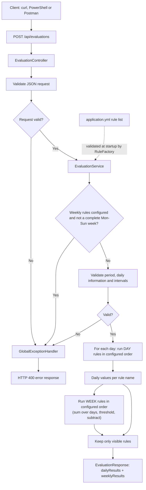

# Application Workflow

```mermaid
flowchart TD
    A["Client: curl, PowerShell or Postman"] --> B["POST /api/evaluations"]
    B --> C["EvaluationController"]
    C --> D["Validate JSON request"]
    D --> E{"Request valid?"}

    E -- No --> F["GlobalExceptionHandler"]
    F --> G["HTTP 400 error response"]

    E -- Yes --> H["EvaluationService"]
    H --> J{"Weekly rules configured and not a complete Mon-Sun week?"}
    J -- Yes --> F
    J -- No --> I["Validate period, daily information and intervals"]
    I --> K{"Valid?"}
    K -- No --> F
    K -- Yes --> L["For each day: run DAY rules in configured order"]

    L --> M["Daily values per rule name"]
    M --> N["Run WEEK rules in configured order<br/>(sum over days, threshold, subtract)"]
    N --> O["Keep only visible rules"]
    M --> O
    O --> P["EvaluationResponse: dailyResults + weeklyResults"]

    Q["application.yml rule list"] -. "validated at startup by RuleFactory" .-> H
```
